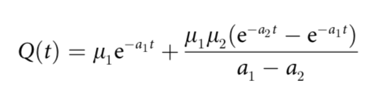
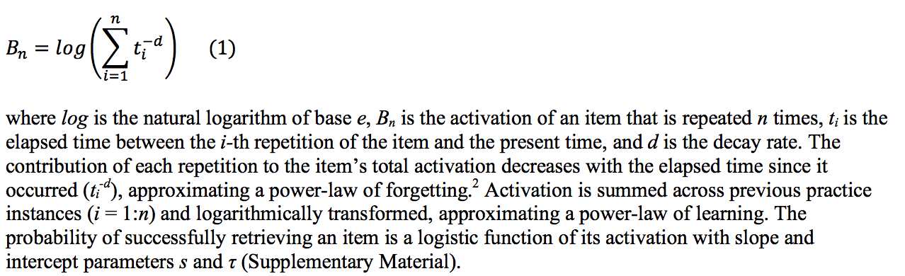

### About this Repository

The Memory Chain Model, below, is a model of forgetting and amnesia where:

- myu_1 is the initial strength of the memory traces in store 1,
- a_1 is the decay rate in store 1,
- myu_2 is the rate of consolidating the contents of store 1 to store 2, and
- a_2 is the decay rate in store 2

Under the conditions of this experiment, store 1 is the hippocampus, where memory exponentially declines in intensity and store 2 is the neocortex, where memory contents are steadily transferred for long-term retention and decline at a lower rate.

I applied Murre and Dros' equation to Walsh et al.'s (2018) work investigating [ACT-R](Pavlik_Anderson_2005.pdf) and two other models of spaced memory practice and, I think, expanded the accuracy of the activation likelihood predictions made by ACT-R's simplified implementation of Ebbinghaus' classic forgetting curve.

Further work could use ACT-R's models of spaced practice and retention; however, I strongly suggest investigating Walsh et al.'s claims that ACT-R is not the best means (of the three they investigated) to model accelerated relearning.
